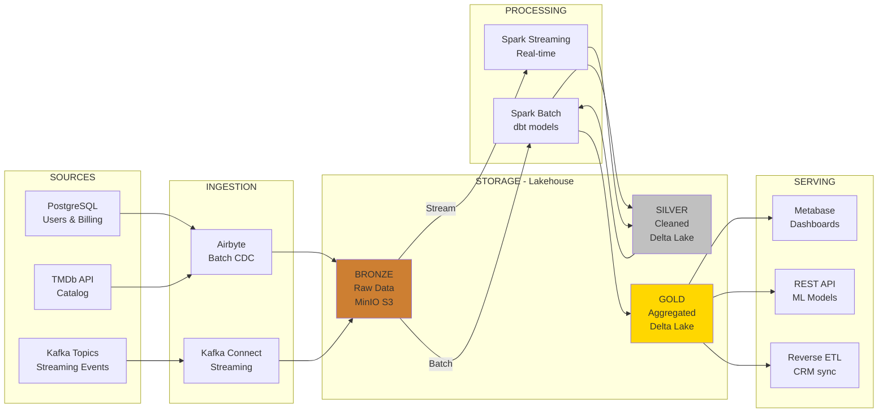

# CineMetrics - Plataforma de Análise de Dados de Streaming de Filmes

**Projeto de Engenharia de Dados - Universidade de Brasília (UnB)**

**Integrantes:**
- [Nome Completo] - Matrícula: [xxxxx]
- [Nome Completo] - Matrícula: [xxxxx]

**Data:** Abril 2026

---

# Índice

1. [Descrição do Projeto](#1-descrição-do-projeto)
2. [Definição e Classificação dos Dados](#2-definição-e-classificação-dos-dados)
3. [Domínios e Serviços](#3-domínios-e-serviços)
4. [Arquitetura - O Que Será Feito](#4-arquitetura---o-que-será-feito)
5. [Tecnologias - Como Será Feito](#5-tecnologias---como-será-feito)
6. [Considerações Finais](#6-considerações-finais)

---

# 1. Descrição do Projeto

## 1.1. Contexto de Negócio

O CineMetrics é uma plataforma de streaming de filmes (similar a Netflix, Prime Video) que precisa construir uma infraestrutura robusta de dados para suportar três objetivos estratégicos:

1. **Análise de comportamento do usuário** em tempo real
2. **Otimização do catálogo** com base em métricas de engajamento
3. **Sistema de recomendação** personalizado

## 1.2. Problema que o Projeto Resolve

Atualmente, empresas de streaming enfrentam desafios como:

- **Dados fragmentados**: eventos de streaming (play, pause, stop) separados de dados de catálogo (filmes, atores, gêneros)
- **Decisões lentas**: relatórios gerenciais demoram dias para serem gerados
- **Experiência genérica**: falta de personalização baseada em dados reais de consumo
- **Desperdício de recursos**: não sabem quais filmes remover ou adicionar ao catálogo

## 1.3. Objetivos Principais

- **Tempo real**: dashboards executivos atualizados a cada 5 minutos
- **Histórico consolidado**: análises de tendências de médio/longo prazo (batch)
- **Data-driven**: fundamentar decisões de catálogo, marketing e produto em dados
- **Escalabilidade**: suportar crescimento de 10 mil para 100 mil usuários simultâneos

## 1.4. Stakeholders e Usuários Finais

| Stakeholder | Necessidade de Dados |
|-------------|---------------------|
| **Equipe de Produto** | Métricas de engajamento (watch time, completion rate, bounce rate) |
| **Marketing** | Segmentação de usuários, performance de campanhas, tendências de gênero |
| **Conteúdo/Catálogo** | Filmes mais assistidos, abandonados, recomendações de aquisição |
| **Executivos (C-level)** | KPIs de negócio (MAU, receita por usuário, churn prediction) |
| **Cientistas de Dados** | Datasets limpos para modelos de ML (recomendação, churn) |

---

# 2. Definição e Classificação dos Dados

## 2.1. Fontes de Dados

### A) Dados Operacionais (Batch)

| Fonte | Descrição | Formato | Volume Estimado | Frequência |
|-------|-----------|---------|-----------------|------------|
| **Catálogo de Filmes** | Metadados de filmes (título, gênero, duração, ano, diretor, elenco) | JSON | ~50 mil filmes | Semanal (novos lançamentos) |
| **Base de Usuários** | Dados cadastrais (ID, nome, email, plano, data_cadastro, país) | CSV | ~100 mil usuários | Diária (incremental) |
| **Histórico de Assinaturas** | Transações financeiras (plano contratado, upgrades, cancelamentos) | Parquet | ~500 mil registros | Diária |
| **Avaliações de Filmes** | Notas e reviews dados pelos usuários | JSON | ~1 milhão de avaliações | Diária |

**Origem**: Banco de dados transacional PostgreSQL (sistema operacional da plataforma)

### B) Dados de Streaming (Tempo Real)

| Fonte | Descrição | Formato | Volume Estimado | Latência |
|-------|-----------|---------|-----------------|----------|
| **Eventos de Visualização** | play, pause, stop, seek, complete | JSON (via Kafka) | ~10 mil eventos/minuto | < 1 segundo |
| **Cliques e Navegação** | Cliques em filmes, busca, scroll no catálogo | JSON (via Kafka) | ~5 mil eventos/minuto | < 1 segundo |
| **Erros de Streaming** | Buffering, falhas de player, qualidade de vídeo | JSON (via Kafka) | ~500 eventos/minuto | < 1 segundo |

**Origem**: Aplicativos (web, mobile, smart TV) para Apache Kafka

## 2.2. Classificação Detalhada

### Dados Operacionais (Batch)

**CATÁLOGO DE FILMES**
- Origem: API externa (TMDb) + banco interno
- Formato: JSON
- Exemplo de estrutura:
```json
{
  "movie_id": "tt1234567",
  "title": "Inception",
  "release_year": 2010,
  "genres": ["Action", "Sci-Fi", "Thriller"],
  "director": "Christopher Nolan",
  "duration_minutes": 148,
  "rating": "PG-13"
}
```
- Periodicidade: Atualização semanal (novas releases)
- Volume: ~50 mil filmes (crescimento de ~200/semana)

**BASE DE USUÁRIOS**
- Origem: PostgreSQL (tabela `users`)
- Formato: CSV (exportação diária)
- Exemplo:
```
user_id,name,email,plan,signup_date,country
U001,Maria Silva,maria@email.com,premium,2024-01-15,BR
```
- Periodicidade: Carga incremental diária (CDC - Change Data Capture)
- Volume: ~100 mil usuários (crescimento de ~500/dia)

**HISTÓRICO DE ASSINATURAS**
- Origem: Sistema de billing (PostgreSQL)
- Formato: Parquet (para otimização de armazenamento)
- Periodicidade: Diária (snapshot completo)
- Volume: ~500 mil transações (crescimento de ~1.5k/dia)

### Dados de Streaming (Tempo Real)

**EVENTOS DE VISUALIZAÇÃO**
- Origem: Player de vídeo (web/mobile/TV) para Kafka Topic: "streaming_events"
- Formato: JSON
- Exemplo:
```json
{
  "event_id": "evt_789xyz",
  "user_id": "U001",
  "movie_id": "tt1234567",
  "event_type": "play",
  "timestamp": "2026-04-27T14:32:15Z",
  "device": "mobile_ios",
  "playback_position_seconds": 0,
  "video_quality": "1080p"
}
```
- Latência: < 1 segundo
- Volume pico: ~10 mil eventos/minuto (horário nobre 20h-23h)

**EVENTOS DE NAVEGAÇÃO**
- Origem: Frontend apps para Kafka Topic: "user_interactions"
- Eventos: click, search, scroll, add_to_watchlist
- Latência: < 1 segundo
- Volume: ~5 mil eventos/minuto

**EVENTOS DE ERRO**
- Origem: Player para Kafka Topic: "streaming_errors"
- Eventos: buffer_start, playback_failed, quality_drop
- Latência: < 1 segundo
- Volume: ~500 eventos/minuto (5% dos eventos totais)

## 2.3. Resumo da Classificação

| Tipo | Características | Casos de Uso |
|------|----------------|--------------|
| **Batch (Operacional)** | Dados estruturados, atualizações periódicas, grande volume histórico | Relatórios gerenciais, análises de tendências, BI tradicional |
| **Streaming (Eventos)** | Alta velocidade, baixa latência, semi-estruturado (JSON) | Dashboards em tempo real, alertas, recomendação instantânea |

---

# 3. Domínios e Serviços

## 3.1. Identificação dos Domínios de Negócio

O CineMetrics é organizado em **4 domínios principais**:

### Domínio: Catálogo
**Responsabilidade**: Gestão do acervo de filmes e metadados

**Serviços**:
- `catalog-management`: CRUD de filmes, sincronização com APIs externas (TMDb)
- `metadata-enrichment`: Enriquecimento de dados (traduções, tags, classificação etária)
- `content-recommendation-engine`: Geração de sugestões baseadas em similaridade

### Domínio: Usuários
**Responsabilidade**: Gestão de contas, autenticação e perfis

**Serviços**:
- `user-management`: Cadastro, login, atualização de perfil
- `subscription-billing`: Gestão de planos, pagamentos, upgrades
- `user-segmentation`: Segmentação para marketing (churn risk, heavy users, etc.)

### Domínio: Streaming
**Responsabilidade**: Entrega de conteúdo e monitoramento de qualidade

**Serviços**:
- `video-player-events`: Captura de eventos (play, pause, stop)
- `quality-monitoring`: Monitoramento de buffering, erros, latência
- `watch-history`: Armazenamento do histórico de visualizações

### Domínio: Analytics
**Responsabilidade**: Geração de insights e métricas de negócio

**Serviços**:
- `real-time-dashboard`: Métricas ao vivo (usuários online, top filmes)
- `batch-reporting`: Relatórios gerenciais (MAU, receita, churn)
- `ml-pipelines`: Pipelines de machine learning (recomendação, previsão de churn)

## 3.2. Serviços Compartilhados (Cross-Domain)

| Serviço | Responsabilidade | Usado por |
|---------|------------------|-----------|
| **Authentication Service** | Login, tokens JWT, SSO | Todos os domínios |
| **Notification Service** | Emails, push notifications | Usuários, Analytics |
| **Data Lake Storage** | Armazenamento centralizado de dados brutos | Todos os domínios |
| **Monitoring & Logging** | Observabilidade (Prometheus, Grafana) | Todos os domínios |

## 3.3. Diagrama de Domínios e Serviços

```mermaid
graph TB
    subgraph "Domínio: Catálogo"
        A1[catalog-management]
        A2[metadata-enrichment]
        A3[content-recommendation]
    end
    
    subgraph "Domínio: Usuários"
        B1[user-management]
        B2[subscription-billing]
        B3[user-segmentation]
    end
    
    subgraph "Domínio: Streaming"
        C1[video-player-events]
        C2[quality-monitoring]
        C3[watch-history]
    end
    
    subgraph "Domínio: Analytics"
        D1[real-time-dashboard]
        D2[batch-reporting]
        D3[ml-pipelines]
    end
    
    subgraph "Serviços Compartilhados"
        E1[Authentication]
        E2[Notification]
        E3[Data Lake]
        E4[Monitoring]
    end
    
    A1 --> E3
    B1 --> E1
    C1 --> E3
    D1 --> E3
    D2 --> E3
    D3 --> E3
    
    style A1 fill:#e1f5ff
    style B1 fill:#fff4e1
    style C1 fill:#ffe1f5
    style D1 fill:#e1ffe1
    style E3 fill:#f0f0f0
```



## 3.4. Matriz de Responsabilidades

| Domínio | Dados Próprios | Consome de | Expõe para |
|---------|----------------|------------|------------|
| **Catálogo** | Filmes, gêneros, diretores | TMDb API | Streaming, Analytics |
| **Usuários** | Perfis, assinaturas | - | Streaming, Analytics |
| **Streaming** | Eventos de player | Catálogo, Usuários | Analytics |
| **Analytics** | Métricas agregadas | Todos os domínios | Stakeholders (BI) |

---

# 4. Arquitetura - O Que Será Feito

## 4.1. Tipo de Arquitetura Escolhida: LAKEHOUSE

### Por que Lakehouse?

Combinamos os melhores aspectos de **Data Lake** e **Data Warehouse**:

| Característica | Data Lake | Data Warehouse | **Lakehouse** |
|----------------|-----------|----------------|---------------|
| Tipos de dados | Estruturados + semi + não | Apenas estruturados | **Todos os tipos** |
| Custo de storage | Baixo (object storage) | Alto (storage proprietário) | **Baixo** |
| Performance (SQL) | Baixa | Alta | **Alta (Delta Lake)** |
| Schema enforcement | Não | Sim | **Sim (opcional)** |
| ACID transactions | Não | Sim | **Sim** |
| Streaming + Batch | Complexo | Difícil | **Nativo** |

**Decisão**: Usaremos **Delta Lake** sobre MinIO (S3-compatible) para ter:
- Armazenamento barato de dados brutos (JSON, Parquet)
- ACID transactions para consistência
- Time travel para auditoria
- Suporte nativo a streaming + batch no mesmo storage

## 4.2. Arquitetura Medalhão (Medallion Architecture)

Organizaremos o Data Lake em **3 camadas**:

**BRONZE (Raw Data)**
- Dados brutos, sem transformação
- Formatos originais (JSON, CSV)
- Retention: 90 dias

**SILVER (Cleaned & Conformed)**
- Dados limpos, dedupados, validados
- Schema enforcement
- Formato: Parquet com Delta Lake
- Retention: 2 anos

**GOLD (Business-Level Aggregates)**
- Tabelas prontas para consumo (BI, ML)
- Agregações pré-calculadas
- Formato: Parquet com Delta Lake
- Retention: Indefinido

## 4.3. Fluxo de Dados Ponta a Ponta



## 4.4. Fluxos Detalhados

### Fluxo BATCH (Dados Operacionais)

**1. EXTRAÇÃO (Diária às 02:00 AM)**
```
PostgreSQL → Airbyte (CDC incremental) → MinIO/bronze/users/*.parquet
```

**2. TRANSFORMAÇÃO (Spark Batch)**
- Limpeza: remove duplicatas, valida schemas
- Enriquecimento: joins com catálogo
- Agregações: métricas diárias (DAU, revenue)

**3. CARREGAMENTO**
```
bronze → silver → gold (Airflow orchestration)
```

**4. CONSUMO**
```
Metabase conecta em gold.user_metrics (tabela Delta)
```

### Fluxo STREAMING (Eventos em Tempo Real)

**1. CAPTURA**
```
Player (web/mobile) → Kafka Topic "streaming_events"
```

**2. PROCESSAMENTO (Spark Streaming)**
- Window de 5 minutos
- Agregações: count(play), avg(watch_time) por filme
- Detecção de anomalias (spike de erros)

**3. ARMAZENAMENTO**
```
Kafka → bronze (raw events) → silver (windowed aggregates)
```

**4. CONSUMO**
```
Metabase dashboard "live" (refresh 30s)
Alertas (Slack) para erros críticos
```

## 4.5. Trade-offs e Justificativas

### Acoplamento
- **Decisão**: Loose coupling via Kafka e Object Storage
- **Justificativa**: Domínios independentes, fácil adicionar novos consumidores
- **Trade-off**: Latência ligeiramente maior vs tight coupling

### Escalabilidade
- **Decisão**: Spark cluster (pode escalar horizontalmente)
- **Justificativa**: Volume pode crescer 10x sem redesign
- **Trade-off**: Overhead de cluster management vs scripts simples

### Disponibilidade
- **Decisão**: MinIO com replicação, Kafka com partições
- **Justificativa**: 99.9% uptime para dados críticos
- **Trade-off**: Custo de infra vs single-node

### Confiabilidade
- **Decisão**: Delta Lake (ACID), schema validation, data quality checks
- **Justificativa**: Evitar dados corrompidos em produção
- **Trade-off**: Performance vs garantias de consistência

### Reversibilidade
- **Decisão**: Open-source stack, formatos abertos (Parquet)
- **Justificativa**: Fácil migrar para AWS/GCP no futuro
- **Trade-off**: Self-managed vs managed services

---

# 5. Tecnologias - Como Será Feito

## 5.1. Stack Completo

```
┌─────────────────────────────────────────────────┐
│           ORQUESTRAÇÃO & MONITORAMENTO           │
│  Apache Airflow | Prometheus | Grafana          │
└─────────────────────────────────────────────────┘
                        ▲
┌───────────┬───────────┴───────────┬─────────────┐
│ INGESTION │    PROCESSING         │   SERVING   │
├───────────┼───────────────────────┼─────────────┤
│ Airbyte   │ Apache Spark          │ Metabase    │
│ Kafka     │ dbt (Spark backend)   │ FastAPI     │
│           │ Delta Lake            │             │
└───────────┴───────────────────────┴─────────────┘
                        ▲
              ┌─────────┴─────────┐
              │     STORAGE       │
              │  MinIO (S3-like)  │
              │  PostgreSQL (MD)  │
              └───────────────────┘
```

## 5.2. INGESTÃO

### Apache Kafka (Streaming)
**O que é**: Plataforma de streaming distribuída (message broker)

**Por que escolhemos**:
- Padrão de mercado para eventos em tempo real
- Alta throughput (10k+ msg/s com hardware modesto)
- Persistência: eventos ficam retidos (retention configurável)
- Integração nativa com Spark Streaming

**Alternativas consideradas**:
- RabbitMQ: mais simples, mas menor throughput
- AWS Kinesis: vendor lock-in, custo alto para teste

**Como vamos usar**:
```python
# Producer (aplicação frontend)
from kafka import KafkaProducer
producer = KafkaProducer(bootstrap_servers='localhost:9092')
producer.send('streaming_events', event_json)

# Consumer (Spark Streaming)
streaming_df = spark.readStream \
    .format("kafka") \
    .option("kafka.bootstrap.servers", "localhost:9092") \
    .option("subscribe", "streaming_events") \
    .load()
```

### Airbyte (Batch)
**O que é**: Ferramenta open-source de ELT (Extract, Load, Transform)

**Por que escolhemos**:
- 300+ conectores prontos (PostgreSQL, APIs, etc.)
- UI amigável para configurar pipelines
- Change Data Capture (CDC) nativo
- Deployment local via Docker

**Alternativas consideradas**:
- Fivetran: pago, não tem free tier robusto
- Scripts Python customizados: trabalho manual, sem UI

**Como vamos usar**:
```yaml
# Configuração de source (PostgreSQL)
source:
  type: postgres
  host: localhost
  database: cinemetrics_prod
  username: readonly_user
  
# Configuração de destination (MinIO)
destination:
  type: s3
  endpoint: http://minio:9000
  bucket: lakehouse-bronze
  format: parquet
```

## 5.3. ARMAZENAMENTO

### MinIO (Object Storage)
**O que é**: Storage compatível com S3, roda on-premise

**Por que escolhemos**:
- API 100% compatível com AWS S3 (fácil migração futura)
- Gratuito e open-source
- Roda em laptop (mínimo 4GB RAM)
- Performance suficiente para 100k usuários

**Alternativas consideradas**:
- AWS S3: custo para teste, precisa cartão de crédito
- Filesystem local: não escalável, sem features de replicação

**Como vamos usar**:
```python
import boto3

s3 = boto3.client('s3',
    endpoint_url='http://localhost:9000',
    aws_access_key_id='minioadmin',
    aws_secret_access_key='minioadmin'
)

# Upload de arquivo
s3.upload_file('events.json', 'lakehouse-bronze', 'streaming/2026/04/27/events.json')
```

### Delta Lake
**O que é**: Camada de storage ACID sobre Data Lake (Parquet + transaction log)

**Por que escolhemos**:
- ACID transactions (evita leituras sujas)
- Time travel: `SELECT * FROM table VERSION AS OF 10`
- Schema evolution sem quebrar pipelines
- Otimizações automáticas (Z-ordering, compaction)

**Alternativas consideradas**:
- Parquet puro: sem ACID, difícil gerenciar updates
- Apache Iceberg: menos maduro, comunidade menor

**Como vamos usar**:
```python
# Escrita (Spark)
df.write.format("delta").mode("overwrite").save("s3a://lakehouse-silver/users")

# Leitura com time travel
old_version = spark.read.format("delta") \
    .option("versionAsOf", 5) \
    .load("s3a://lakehouse-silver/users")
```

### PostgreSQL (Metadata & Small Tables)
**Por que ainda usamos**:
- Airflow metadata (DAGs, runs, logs)
- Tabelas pequenas de lookup (países, gêneros)
- Feature store para ML (low-latency reads)

## 5.4. PROCESSAMENTO E TRANSFORMAÇÃO

### Apache Spark
**O que é**: Engine de processamento distribuído (batch + streaming)

**Por que escolhemos**:
- Processa batch (histórico) e streaming (tempo real) com mesma API
- Scala + Python (PySpark) - acessível para iniciantes
- Integração nativa com Delta Lake e Kafka
- Roda local (modo standalone) ou em cluster

**Alternativas consideradas**:
- Apache Flink: curva de aprendizado maior
- Pandas: não escala (memória limitada)

**Como vamos usar**:
```python
# Batch processing
from pyspark.sql import SparkSession

spark = SparkSession.builder \
    .appName("CineMetrics ETL") \
    .config("spark.jars.packages", "io.delta:delta-core_2.12:2.4.0") \
    .getOrCreate()

# Ler de bronze
raw_events = spark.read.format("delta").load("s3a://lakehouse-bronze/events")

# Transformar
clean_events = raw_events \
    .dropDuplicates(["event_id"]) \
    .filter("event_type IN ('play', 'pause', 'complete')")

# Escrever em silver
clean_events.write.format("delta").mode("append").save("s3a://lakehouse-silver/events")
```

```python
# Streaming processing
stream = spark.readStream \
    .format("kafka") \
    .option("subscribe", "streaming_events") \
    .load()

aggregated = stream \
    .groupBy(window("timestamp", "5 minutes"), "movie_id") \
    .agg(count("*").alias("play_count"))

query = aggregated.writeStream \
    .format("delta") \
    .outputMode("append") \
    .option("checkpointLocation", "/tmp/checkpoint") \
    .start("s3a://lakehouse-silver/aggregates")
```

### dbt (Data Build Tool)
**O que é**: Framework de transformação SQL com versionamento e testes

**Por que escolhemos**:
- Transforma SQL em DAGs automaticamente
- Data quality tests nativos (`not_null`, `unique`, `relationships`)
- Documentação auto-gerada
- dbt-spark adapter (roda sobre Spark)

**Como vamos usar**:
```sql
-- models/silver/users_cleaned.sql
{{ config(materialized='incremental') }}

SELECT
    user_id,
    LOWER(email) as email,
    plan,
    signup_date,
    country
FROM {{ source('bronze', 'users') }}
WHERE email IS NOT NULL

    AND updated_at > (SELECT MAX(updated_at) FROM {{ this }})

```

```yaml
# schema.yml (testes)
models:
  - name: users_cleaned
    columns:
      - name: user_id
        tests:
          - unique
          - not_null
      - name: email
        tests:
          - not_null
```

## 5.5. ORQUESTRAÇÃO

### Apache Airflow
**O que é**: Plataforma de workflow orchestration (DAGs)

**Por que escolhemos**:
- Padrão da indústria (usado por Airbnb, Netflix, etc.)
- UI rica para monitorar pipelines
- Retry automático, alertas, logs centralizados
- Integrações com Spark, dbt, Kafka

**Como vamos usar**:
```python
from airflow import DAG
from airflow.providers.apache.spark.operators.spark_submit import SparkSubmitOperator
from airflow.operators.bash import BashOperator
from datetime import datetime, timedelta

default_args = {
    'owner': 'data-team',
    'retries': 2,
    'retry_delay': timedelta(minutes=5)
}

with DAG('daily_etl',
         default_args=default_args,
         schedule_interval='0 2 * * *',  # 02:00 AM diário
         start_date=datetime(2026, 4, 1)) as dag:
    
    # Task 1: Ingestão (Airbyte trigger)
    ingest = BashOperator(
        task_id='ingest_postgres',
        bash_command='airbyte trigger --connection-id abc123'
    )
    
    # Task 2: Transformação (Spark)
    transform = SparkSubmitOperator(
        task_id='transform_to_silver',
        application='/opt/spark/jobs/bronze_to_silver.py',
        conf={'spark.executor.memory': '2g'}
    )
    
    # Task 3: dbt (agregações)
    dbt_run = BashOperator(
        task_id='dbt_gold_layer',
        bash_command='cd /dbt && dbt run --models gold.*'
    )
    
    ingest >> transform >> dbt_run
```

## 5.6. SERVIR DADOS / CONSUMO

### Metabase
**O que é**: Ferramenta de BI open-source

**Por que escolhemos**:
- Interface intuitiva (stakeholders não-técnicos)
- SQL nativo + query builder visual
- Dashboards interativos com filtros
- Conecta direto em Delta Lake via Spark Thrift Server

**Como vamos usar**:
```sql
-- Dashboard: Top 10 filmes da semana
SELECT
    m.title,
    COUNT(DISTINCT e.user_id) as unique_viewers,
    SUM(e.watch_time_seconds) / 3600 as total_hours
FROM gold.streaming_events e
JOIN gold.movies m ON e.movie_id = m.movie_id
WHERE e.event_date >= CURRENT_DATE - INTERVAL 7 DAYS
GROUP BY m.title
ORDER BY total_hours DESC
LIMIT 10
```

### FastAPI (REST API para ML)
**Por que escolhemos**:
- Python nativo (integração fácil com modelos scikit-learn/TensorFlow)
- Performance alta (async)
- Auto-documentação (Swagger UI)

**Como vamos usar**:
```python
from fastapi import FastAPI
import joblib

app = FastAPI()
model = joblib.load('models/churn_predictor.pkl')

@app.post("/predict/churn")
def predict_churn(user_id: str):
    features = get_user_features(user_id)  # query Delta Lake
    prediction = model.predict([features])
    return {"user_id": user_id, "churn_risk": float(prediction[0])}
```

## 5.7. CORRENTES DO CICLO DE VIDA

### Segurança
- **Autenticação**: Airflow com LDAP, Metabase com SSO
- **Criptografia**: MinIO com TLS, Kafka com SASL/SSL
- **LGPD**: Anonimização de PII em silver layer (hash de emails)

### Gestão de Dados
- **Data Catalog**: Apache Atlas (metadata management)
- **Lineage**: dbt docs + Airflow UI (quem criou cada tabela)
- **Quality**: dbt tests + Great Expectations

### DataOps
- **CI/CD**: GitHub Actions para deploy de DAGs e dbt models
- **Versionamento**: Git para código, Delta Lake time travel para dados
- **Testing**: Pytest para pipelines, dbt tests para schemas

### Monitoramento
- **Métricas**: Prometheus (Airflow, Spark, Kafka metrics)
- **Dashboards**: Grafana (infra health, pipeline SLAs)
- **Alertas**: Slack notifications para falhas críticas

### Governança
- **Ownership**: Cada domínio tem um data owner (via CODEOWNERS no Git)
- **Policies**: Retenção de dados (bronze 90d, silver 2y, gold indefinido)
- **Compliance**: Audit logs em todas as escritas (Delta Lake transaction log)

---

# 6. Considerações Finais

## 6.1. Principais Riscos e Limitações

| Risco | Impacto | Mitigação |
|-------|---------|-----------|
| **Hardware insuficiente** | Spark pode travar com <8GB RAM | Testar em sample (10% dos dados), usar modo local |
| **Complexidade inicial** | Curva de aprendizado (Kafka, Spark, Airflow) | Começar com POCs simples, documentar cada passo |
| **Latência de streaming** | Eventos podem atrasar (network issues) | Configurar Kafka retention, monitorar lag |
| **Qualidade dos dados** | Dados ruins em bronze levam a problemas em gold | Implementar validações em silver (dbt tests) |
| **Custo de manutenção** | Cluster self-managed exige DevOps | Automatizar com Docker Compose, scripts de setup |

## 6.2. Próximos Passos para Parte 2 (Implementação)

### Fase 1: Setup de Infraestrutura (Semana 1-2)
- Docker Compose com todos os serviços (Kafka, MinIO, Spark, Airflow, Metabase)
- Scripts de inicialização automática
- Repositório Git com estrutura de pastas definida

### Fase 2: POC de Ingestão (Semana 3-4)
- Gerar dados sintéticos (script Python para simular eventos)
- Configurar producer Kafka
- Airbyte: conectar PostgreSQL para MinIO

### Fase 3: Transformações Bronze para Silver (Semana 5-6)
- Job Spark para limpeza de eventos
- dbt models para tabelas silver
- Testes de qualidade (nulls, duplicatas)

### Fase 4: Agregações Gold + Dashboards (Semana 7-8)
- dbt models para métricas de negócio
- Metabase: 3 dashboards principais (real-time, weekly, churn)

### Fase 5: Orquestração + Monitoramento (Semana 9-10)
- DAGs do Airflow para automação
- Grafana dashboards para infra
- Documentação final

## 6.3. Prova de Conceito Mínima (para validar escolhas)

**O que vamos implementar ANTES da Parte 2:**

```python
# poc_kafka_spark.py - 50 linhas
# Objetivo: Provar que Kafka -> Spark -> Delta Lake funciona

from pyspark.sql import SparkSession
from kafka import KafkaProducer
import json, time

# 1. Producer simples
producer = KafkaProducer(bootstrap_servers='localhost:9092')
for i in range(100):
    event = {"user_id": f"U{i}", "movie_id": "M1", "event": "play"}
    producer.send('test_events', json.dumps(event).encode())
    time.sleep(0.1)

# 2. Consumer com Spark Streaming
spark = SparkSession.builder.appName("POC").getOrCreate()
df = spark.readStream.format("kafka") \
    .option("kafka.bootstrap.servers", "localhost:9092") \
    .option("subscribe", "test_events").load()

# 3. Escrever em Delta
query = df.writeStream.format("delta") \
    .option("checkpointLocation", "/tmp/chk") \
    .start("/tmp/delta_poc")

query.awaitTermination(timeout=60)
print("POC funcionou! 100 eventos processados")
```

**Resultado esperado**: Se rodar sem erros, confirmamos que a stack funciona.

## 6.4. Referências Utilizadas

### Livros e Artigos
1. **Fundamentals of Data Engineering** (Reis & Housley, 2022)
2. **Designing Data-Intensive Applications** (Martin Kleppmann, 2017)
3. **The Data Warehouse Toolkit** (Ralph Kimball, 2013)
4. **Delta Lake: The Definitive Guide** (Databricks, 2023)

### Documentação Oficial
- Apache Kafka: https://kafka.apache.org/documentation/
- Apache Spark: https://spark.apache.org/docs/latest/
- Delta Lake: https://docs.delta.io/
- dbt: https://docs.getdbt.com/
- Airbyte: https://docs.airbyte.com/

### Tutoriais e Cursos
- Data Engineering Zoomcamp (DataTalks.Club)
- Spark Streaming Programming Guide
- Kafka The Definitive Guide (O'Reilly)

### Blogs Técnicos
- Netflix Tech Blog (Data Platform)
- Uber Engineering (Real-time Analytics)
- Databricks Blog (Lakehouse Architecture)

---

**Fim do Documento**
