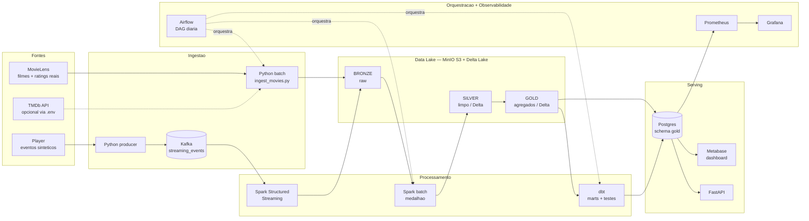

# CineMetrics — Plataforma de Análise de Dados de Streaming

**Projeto de Engenharia de Dados — Parte 2 (Implementação)**
Ciência de Dados e Machine Learning · UniCEUB · 2026/1

Implementação funcional, ponta a ponta, do ciclo de vida de engenharia de dados planejado na Parte 1: ingestão (batch + streaming), armazenamento em Data Lake (medalhão), processamento, orquestração, consumo (BI + API) e as correntes de qualidade, segurança, governança e monitoramento. Toda a stack sobe via `docker compose` em um laptop.

> **Integrantes:**
> - Lucas Leandro Wall Bruno — RA 22251965
> - Jamille Rocha Ghazaleh — RA 22304304

---

## 1. Arquitetura "As-Built" (o que foi efetivamente implementado)



### Stack implementada

| Etapa do ciclo | Ferramenta | Papel |
|---|---|---|
| **Ingestão (batch)** | Python + boto3 | MovieLens → BRONZE (raw). Conector TMDb opcional. |
| **Ingestão (streaming)** | Kafka + Python producer | Eventos do player em tempo real. |
| **Armazenamento** | MinIO (S3) + **Delta Lake** | Data Lake medalhão: bronze / silver / gold (ACID, time travel). |
| **Processamento** | **Apache Spark 3.5.3** (PySpark) | Batch (medalhão) + Structured Streaming. |
| **Transformação/Qualidade** | **dbt** (postgres) | Camada de marts + 11 testes de qualidade. |
| **Orquestração** | **Apache Airflow** | DAG encadeia ingestão → medalhão → qualidade. |
| **Consumo (BI)** | **Metabase** | Dashboard sobre a camada gold. |
| **Consumo (API)** | **FastAPI** | Serving REST do gold. |
| **Monitoramento** | **Prometheus + Grafana** | Métricas (postgres-exporter) + dashboards. |

---

## 2. Camadas do Data Lake (Medallion)

| Camada | Conteúdo | Formato |
|---|---|---|
| **BRONZE** | Dados crus, sem transformação (CSV MovieLens, eventos Kafka) | CSV / Delta |
| **SILVER** | Limpo, tipado, deduplicado, com schema enforcement | Delta |
| **GOLD** | Agregados de negócio prontos p/ BI/ML | Delta + Postgres |

Tabelas gold: `movie_metrics`, `genre_popularity`, `ratings_over_time`, `top_movies`.

---

## 3. Estrutura do repositório

```
cinemetrics/
├── docker-compose.yml          # toda a stack (profiles: streaming, orchestration, serving, api, monitoring)
├── docker/                     # imagens custom (spark+delta, airflow+docker-cli, ingestion)
├── ingestion/
│   ├── batch/ingest_movies.py  # MovieLens/TMDb -> bronze
│   ├── streaming/event_producer.py
│   └── common/lake.py          # helper S3/MinIO
├── transformation/
│   ├── spark/                  # bronze_to_silver, silver_to_gold, stream_events_to_bronze
│   └── dbt/                    # projeto dbt (marts + testes de qualidade)
├── orchestration/airflow/dags/cinemetrics_pipeline.py
├── serving/api/                # FastAPI
├── monitoring/                 # prometheus.yml + grafana provisioning
├── scripts/postgres-init/      # cria bancos airflow/metabase + schema gold
└── docs/architecture.md
```

---

## 4. Como rodar (reprodução)

**Pré-requisitos:** Docker + Docker Compose (testado com OrbStack em macOS Apple Silicon / 16 GB).

```bash
# 1. configurar ambiente
cp .env.example .env

# 2. storage + processamento + ingestão (cria buckets do medalhão)
docker compose up -d

# 3. pipeline batch (manual) — ou pule direto pro Airflow no passo 4
docker exec cinemetrics-ingestion python ingestion/batch/ingest_movies.py
docker exec cinemetrics-spark /opt/spark/bin/spark-submit /opt/jobs/bronze_to_silver.py
docker exec cinemetrics-spark /opt/spark/bin/spark-submit /opt/jobs/silver_to_gold.py

# 4. orquestração (Airflow) — http://localhost:8080  (admin / admin)
docker compose --profile orchestration up -d airflow
#   no UI: unpause + trigger o DAG "cinemetrics_pipeline"

# 5. consumo
docker compose --profile serving up -d metabase   # BI:  http://localhost:3000
docker compose --profile api up -d api             # API: http://localhost:8000/docs

# 6. streaming (tempo real)
docker compose --profile streaming up -d           # Kafka + producer + Spark Streaming

# 7. monitoramento
docker compose --profile monitoring up -d          # Prometheus :9090 · Grafana :3001 (admin/admin)
```

Atalhos equivalentes em `make up`, `make pipeline`, `make stream`, `make down` (ver `Makefile`).

**Acessos:** MinIO console `:9001` · Metabase `:3000` · Airflow `:8080` · API `:8000/docs` · Prometheus `:9090` · Grafana `:3001`.

**Painel de demonstração:** abra [`demo/index.html`](demo/index.html) no navegador — porta de entrada única com links e credenciais de todos os serviços.

---

## 5. Correntes do ciclo de vida

- **Qualidade:** 11 testes dbt (`not_null`, `unique`) sobre o gold + schema enforcement do Delta + dedupe/validação no Spark. Roda como etapa do DAG (gate).
- **Segurança:** credenciais via `.env` (fora do git); rede Docker isolada; acesso ao Lake por chave S3.
- **Governança:** medalhão com responsabilidades claras por camada; lineage rastreável (Airflow DAG + dbt); Delta transaction log = auditoria; políticas de retenção documentadas (bronze/silver/gold).
- **Monitoramento:** Prometheus (postgres-exporter) + Grafana; logs centralizados no Airflow.

---

## 6. Relatório de Mudanças (As-Built vs Parte 1)

O plano original era propositalmente ambicioso. Na implementação, ajustamos a stack para que ficasse **funcional e reproduzível em um laptop (Apple Silicon, 16 GB)**, sem perder nenhuma etapa do ciclo de vida. Principais mudanças e justificativas técnicas:

| # | Planejado (Parte 1) | Implementado | Justificativa |
|---|---|---|---|
| 1 | Spark (versão ponta) | **Spark 3.5.3** | Delta Lake não tem release estável p/ Spark 4.1; 3.5.3 + Delta 3.2.1 é combinação comprovada. |
| 2 | **Airbyte** (ingestão batch) | Script Python + boto3 | Airbyte sobe dezenas de containers e sofre em ARM/16 GB. Script cobre o mesmo papel (extração → carga). |
| 3 | **TMDb API** como fonte | **MovieLens** (real) + conector TMDb opcional | Evita dependência de API key pessoal; MovieLens dá filmes + ratings reais. TMDb ativável via `.env`. |
| 4 | Metabase lendo Delta direto | Metabase lê **gold no Postgres** | Mais simples/robusto que Spark Thrift Server; Delta gold mantido como camada analítica. |
| 5 | Airflow em cluster (Celery) | Airflow **single-container** (LocalExecutor) | Economia de RAM; suficiente para o protótipo. |
| 6 | dbt sobre Spark | **dbt sobre Postgres** (gold) | Mesmos testes de qualidade, muito mais leve que dbt-spark/Thrift. |
| 7 | Atlas + Great Expectations | dbt tests + governança documentada | Cobrem qualidade/governança sem subir mais infraestrutura. |
| 8 | Prometheus/Grafana (amplo) | Prometheus + Grafana + **postgres-exporter** | Monitoramento real do banco, enxuto. |

Detalhe da arquitetura em [`docs/architecture.md`](docs/architecture.md).

---

## 7. Evidências de validação (dados reais)

- **Ingestão:** 9.742 filmes · 100.836 ratings · 3.683 tags (MovieLens).
- **Silver:** movies 9.742 · ratings 100.836 · users 610.
- **Gold:** `movie_metrics` 9.724 · `genre_popularity` 20 · `ratings_over_time` 267 meses.
- **Top gênero:** Drama (41.928 ratings, média 3,66). **Top filme:** Forrest Gump (329 ratings).
- **Streaming:** ~20 eventos/s → bronze Delta validado.
- **Orquestração:** DAG `cinemetrics_pipeline` executado com todas as tasks em `success`.
- **Qualidade:** `dbt build` → PASS=12 / FAIL=0.
